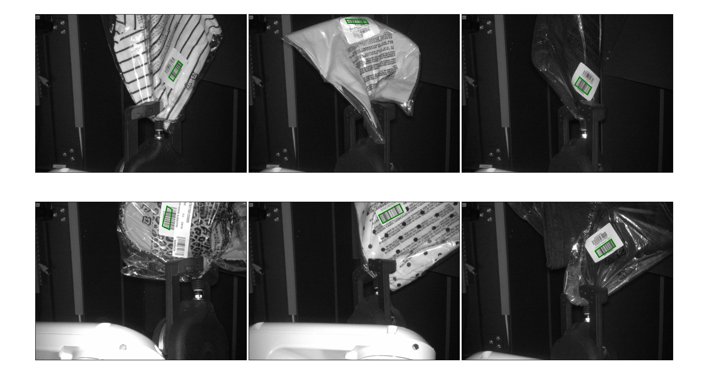

# Train a model to localize barcodes in scanner images

This repository contains the code to download the data and to train models to
localize barcodes in scanner images.  

The input data we have stored in S3 looks like the following:

 

Below are some examples of predictions by a trained model:


More details on the project can be found on the [wiki page](https://kindredai.atlassian.net/wiki/spaces/PID/pages/2087714884/Learning+to+recognize+barcodes+in+scanner+images).

Currently the models are implemented in `tensorflow` and `keras`.

To download the data:

```
python data_reader_gc.py --datadir `path_to_a_directory_to_store_the_data_to`

```
To train the model:

```
python train.py --datadir `path_to_a_directory_containing_the_data` 

```

// TODO: add requirements.txt